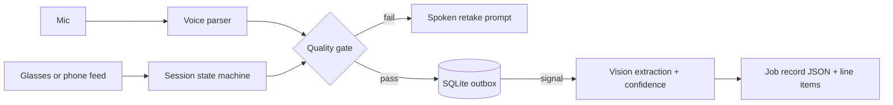

```mermaid
flowchart LR
  G[Glasses or phone feed] --> S[Session state machine]
  M[Mic] --> V[Voice parser]
  V --> Q{Quality gate}
  S --> Q
  Q -- fail --> R[Spoken retake prompt]
  Q -- pass --> O[(SQLite outbox)]
  O -- signal --> X[Vision extraction + confidence]
  X --> J[Job record JSON + line items]
```
